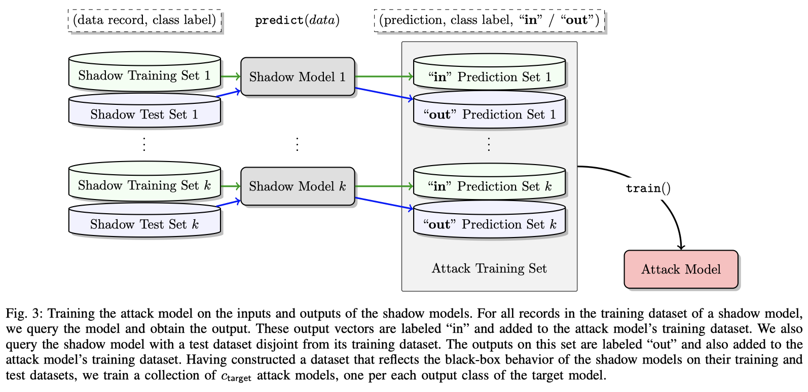
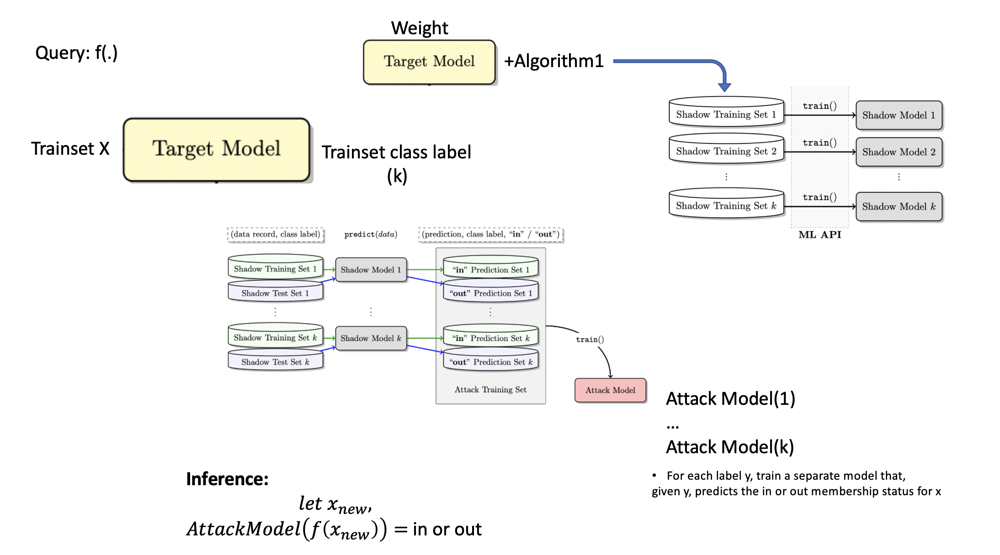
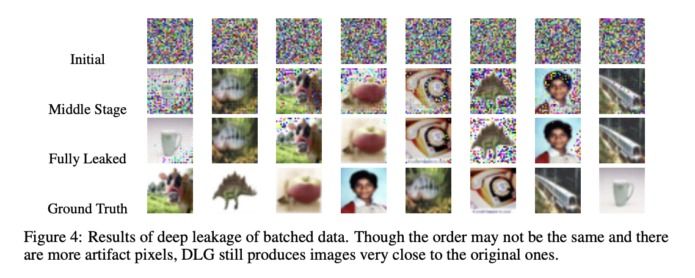

# Membership Inference Attacks Against Machine Learning Models
> 20.03.25. DMALB yeongjae Gild
---
- INDEX
    - Recent Talk
    - Literature review
---
## Recent Talk
- 취업 준비
    - ~~지옥의~~ 코딩 테스트
        - 자료구조 & 알고리즘
    - tech 공부
        - git
        - linux
        - docker
        - ...
    - ML 공부
        - 비숍 정주행 ~~해야하는 데~~
        - NLP, CNN 등 딥러닝 전반적으로 공부중
        - 구현 연습
---

 
---
### Pravacy preserving ML의 근본적인 의문
- DP가 noise를 더해서 개인정보보호하는 건 알겠는데 도대체 어떻게 개인정보를 알아낼 수 있지?
- 도대체 information leakage는 뭘까? 
- Gradient로 도대체 어떻게 A라는 사람의 정보를 알 수 있을까?
- Query는 도대체 정확히 뭘까?
- 해결책: 고민하는 시간에 논문을 읽으면 된다!
---
### Introduction
- Investigate how machine learning models **leak information** about the **individual data** records on which they were trained.

- **Membership inferece**: given a machine learning model and a record, determine whether this record was used as part of the **model's training dataset or not**.

- make adversarial use of machine learning and train our own inference model to recognize differences in the target model's predictions on the inputs that it trained on versus the inputs that it did not train on.

- The adversary's access to the model is limited to **black-box** *queries* that return the model's ouput on a given input.
> white-box models: structure and parameters are known to the adversary
> black-box models: structure and parameters are unknown to the adversary
---
### Methodology
- To construct our attack models, we invented a **shadow training** technique.
    - multiple **shadow training models** that imitate the behavior of the target model
---
- **First method**
    - use black-box access to the target model to synthesize this data.
    - does not assume any prior knowledge about the distribution of target model's training data
- **Second method**
    - uses statistics about the populations from which the target's training dataset was drawn
- **Third method**
    - assumes that the adversary has access to a potentially noisy version of the target's training dataset/
    - 2 & 3 allow the attacker to **query the target model only once** before inferring whether a given record was in its training dataset.
---
- Our inference techniques are generic and not based on particular dataset or model type.
- ALL of our experiments on Amazon's and Google Prediction API.
    - without knowing the learning algorithms used by these services nor the architecture of the resultring models.
        - Google don't reveal this information to the customers.
    - Dataset
        - image, retail purchases, location traces and hospital inpatient stays

---
- membership inference problem is essentially the same as the well-known problem of identifying the presence of an individual's data in a mxied pool given some statistics about the poll.
    - The goal is to infer membership given a black-box API to a model of unknown structure, as opposed to explicit statistics.
- Infering information about the model's training dataset should not be confused with techniques such as **model inversion**
     - model inversion: use a model's output on a hidden input to infer something about this input or extract features that characterize one of the model's classes. 
         - does not produce an actirual member of the model's training dataset, nor, given a record, does it infer whether this record was in the training dataset.Q)?
---
- Our experimental results show that models can leak a lot of information about their training datasets.
---
- Service platforms provide simple APIs for
    - uploading the data
    - for training and querying models
    - making ML technology available to any customer.
- The details of the models and the training algorithms are hidden from the data owners.
---
- privacy in the context of machine learning
    - a machine learing model to breach privacy
- A. Inference about member of the population
    - statistical disclosure control states that the model should reveal no more about the input without applying the model.
    - Related notion on model inversion
        - a privacy breach occurs if an adversary can use the model's output to inder the values of uninteded (sensitive) attributes used as input to the model.
        - Q
---
- B. Inference about members of the training dataset
    - To bypass the difficulties inherent in defining and protecting privacy of the entire polulation, we focus on protecting **privacy of the individuals** whose data was used to train the model.
        - This motivation is closely related to the original goals of differential privacy.
    - Our ultimate goal is to measure the membership risk that a person incurs if they allow their data to be used to train a model.
    - The basic attack in this setting is **membership inference**, i.e., determining whether a given data record was part of the model's training dataset or not.
        - when a record is fully known to the adversary, learning that it was used to train a particular model is an indication of information leakage through the model.
            - in some cases, it can directly lead to a privacy breach.
            - EX) knowing that a certain patient's clinical record used to train a model associated with a disease (e,g. determine the appropriate medicine dosage or to discover the genetic basis of the disease) can reveal that the patient has this disease.
     - We investigate the membership inference problem in the black-box scenario where the adversary can only supply inputs to the model and receive the model's output(s). 
          - EX)
              - app developer may use a machine-learning service to construct a model from the data collected by the app
              - have the app make API calls to the resulting model.
              - the adversary would supply inputs to the app(rather than directly to the model) and reveice the app's outputs
              - we assume that the adverary directly supplies imputs to and receives outputs from the black-box model. (server semi-honest)
---
#### Related work
- Attacks on statistical and machine learning models
    - In knowlege of the parameters of SVM and HMM models is used to infer general statistical information about the training dataset
        - whether records of a particular race were used during taining
    - Our inference attacks work in a black-box setting, without any knowledge of the model's parameters, and infer information about specific records in the training dataset, as opposed to general statistics.
    - Other attacks on machine learning include, where the adversary exploits changes in the outputs of a collaborative recommender system to infer inputs that caused these changes.
        - These attacks exploit temporal behavior specific to the recommender systems based on collaborative filtering
---
- Model inversion
    - uses the output of a model applied to a hidden input to inder cerain features of this input.
    - In general, model inversion cannot tell whether a particular record was used as part of the model's training dataset.
    - Given a record and a model, model inversion works exactly the same way when the record was used to train the model and when it was not used. 
    - Model inversion has also applied to face recognition models. It is used to construct an input that produces these outputs. This input is not an actual member of the taining dataset but simply an average of the features that "characterize" the class.
        - in the case of single person, the movel inversion constructs an artificial image that is an average of these photos.
        - not produc any **specific image** from the training dataset.
        - If the images in class are diverse, the results of model inversion as used in are semantically meaninngless.
---
- In summary, model inversion produces the average of the features that at best can characterize an entire output class
    - (1) It does not construct a specific member of the training dataset
    - (2) nor given given an input and a model, determines if this specific input was used to train the model.
---
#### Privacy-presercing machine learning
- privacy protection in machine learning focuses mostly on how to learn without direct access to the traning data.
- The goal is to limit information leakage during training.
- The training algorithm is the same as in the non-privacy-preserving case, thus the resulting models are as vulnerable to inference attacks as any conventionally trained model.
- This also holds for the models trained by computing on encrypted data
- Differential privacy  has been applied learning an unknown probanility distribution over a discrete polulation from random samples, and releasing hyper-parameters and classifier accuracy. 
- By definition, differentially private models limit the sucess probability of membership inference attacks based solely on the model, which includeds the attacks described in this paper
---

#### Problem statement
- For any input data record, the model outputs the prediction vector of probabilities, one per class, that the record belongs to a certain class.
    - these probabilities as **confidence values**
    - the class with the highest confidence value is selected as the predicted label for the data record.
- Assumption
    - the attacker has query access to the model(**grandient values**) and 
    - the attacker can obtain the model's prediction vector on any data record.
    - the attacker knows the format of the inputs and outputs of the model, including their number and the range of values they can take.
    - (1) knows the type and architecture of the machine learning model, as well as the training algorithm
    - (2) has black-box access to a machine learning oracle (e.g., a "machine learning as a service" platform) that was used to train the model.
        - the attacker does not know a priori the model's structure or meta-parameters.
    - Attacker may have some background knowledge about the polulation from which the target model's trainig dataset was drawn.
        - he may have independently drawn samples from the population, disjoint from the target model's training dataset.
        - the attacker may know some general statistics about the population, for example, the marginal distribution of feature values.
---
- Setting
    - The attacker is given a data record and black-box query access to the target model.
    - The attacker succeeds if the attacker can coorectly determine whether this data record was part of the model's training dataset or not.
    - The standard metrics for attack accuracy are precision (what fraction of records inferred as members are indeed members of the training data set) and recall
---
- A. Overview of the attack
    - The objective of the attacker is to construct an attack model that can recognize such differences in the target model's behavior and use them to distinguish members from non-members of the target model's training dataset based solely on the target model's output.
    - attck model is a collection of models, one for each output class of the target model.
        - This increases accuracy of the attack because the target model produces different distributions over its output classes depending on the input's true class.
    - To train attack model, we build multiple "shadow" models intended to behave similarly to the target model.
        - We know the ground truth for each shadow model (a given data was in its training dataset or not)
        - label "in", "out"
---

---

---

---
| Model | INPUT | OUTPUT |
|---|:---:|---:|
| `Target model(1)` | X | Y(class label) |
| `Shadow model(k)` | trainset Synthesis X | trainset Synthesis y |
| `Attack model(k)` | Synthesis prediction(train, test) | Synthesys in/out |
| `Inference` | f_{target}(x_{new}) | ? |

---
### Why our attacks work
- similar models trained on relatively similar data records using the smae service behave in a similar way.
- Success of membership inference is directly related to the 
    - (1) generalizability of the target model
    - (2) divesity of its training data

---
### MITIGATION
- overfitting is an important reason why machine learning models leak information about their training datasets.
    - overfitting limits the predictive power and generaliability of models
    - This means that instead of the usual tradeoff between utility and privacy, machine learning research and privacy research have similar objective in this case
- Regularization such as dropout
    - defeat overfitting and strengthen privacy guarantees in NN.
    - also used for objective perturbation in DPML
    - Well-regularized models should not leak much informaition about their training data.
- DP models are secure against membership inference attacks of the kind developed in this paper because our attacks operate solely on the outputs of the model
- One obstacle is that DP models may significantly reduce the model's prediction accuracy for small $\epsilon$ values.
#### mitigation strategies
- Restrict the prediction vector to top $k$ classes
    - The smaller $k$ is, the less information the model leaks.
- Coarsen precision of the prediction vector
    - down to d floating point digits
---
### Evaluation
- Data
    - CIFAR
    - Purchases
    - Locations
    - Texas hospital stays
    - MNIST
    - UCI Adult
- Target model
    - machine learning as a service platforms (Google and Amazon)
    - one we implemented locally
    - In all cases, our attacks treat the models as black boxes.
        - For cloud services, we don't know the type of structure of the models tehy create, nor the values of the hyper-parameters used during the training process.
- Accuracy of the attack
    - The attacker's goal is to determine whether a given recods was part of the target model's tranining dataset.
    - We evaluate this attack by executing it on randomly reshuffled records from the target's traning and test datasets
    - use sets of the same size (i.e, equal number of members and non-members) in order to maximize the uncertainty of inference, thus the baseline accuracy is 0.5.
    - precision and recall
---
#### Conclusion
- key technical innovation
    - the shadow training technique trains an attack model to distinguish the target model's outputs on members vs non-members of its training dataset.
    - shaow models used in this attack can be effectively created using synthetic or noisy data
        - In the case of synthetic data generated from the target model itself, the attack does not require any prior knowledge about the distribution of the target model's training data.
---
## ATTACK
- Membership Inference Attacks Against Machine Learning Models (2015)
- Model Inversion Attacks that Exploit Confidence Information and Basic Countermeasures(2015)
- Machine Learning with Membership Privacy using Adversarial Regularization (2018)
---
- Deep leakage gradients (2019)
    - 하나의 정보로는 털 수 있음.
    - batch 일때는 too slow

---
- 

---
## Differential Privacy
- Privacy-Preserving Deep Learning(2015)
- Deep Learning with Differential Privacy(2016)
- Renyi Differential Privacy (2017)
- Semi-supervised knowledge transfer for deep learning from private training data(2017).
- Distributed Deep Learning under Differential Privacy with the Teacher-Student Paradigm
---
